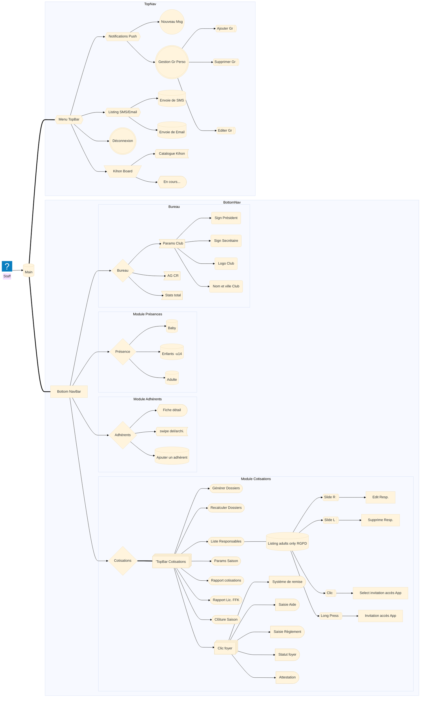
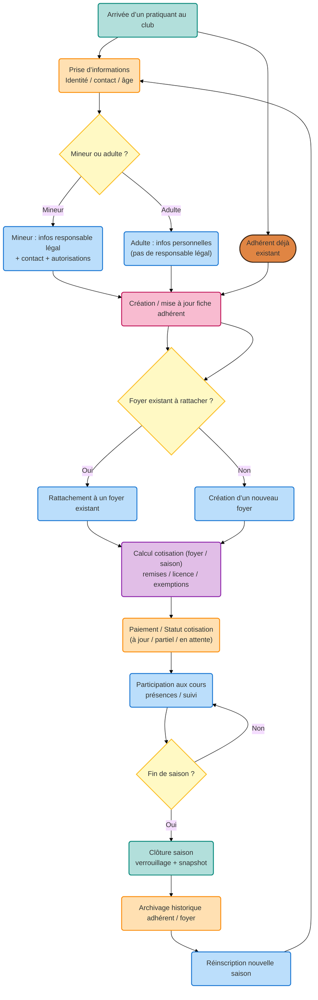

 

<h1> Architecture fonctionnelle globale </h1>

<h3>Flux principal du système vision globale de l'application</h3>

Ce flux représente le fonctionnement réel du club au fil de l’année.

# Cycle de vie d’un adhérent

Modèle relationnel simplifié

ADHERENT ||--o{ HOUSEHOLD : appartient
HOUSEHOLD ||--o{ COTISATION : calcule
SEASON ||--o{ COTISATION : contient
SEASON ||--o{ AG : organise
AG ||--o{ MINUTES : genere

Architecture logique de l’application
flowchart TD

UI[Compose UI] --> VM[ViewModel]
VM --> REPO[Repository]
REPO --> FIRESTORE[Firestore]
REPO --> AUTH[Firebase Auth]
REPO --> STORAGE[Firebase Storage]

Organisation des données Firestore (conceptuelle)

Structure logique :

users/
adherents/
households/
seasons/
cotisations/
season_admin/
notifications/
groups/

États d’une saison
stateDiagram-v2
[*] --> Active
Active --> AG_PREPARED
AG_PREPARED --> MINUTES_READY
MINUTES_READY --> CLOSED
CLOSED --> ARCHIVED

États d’un document AG / CR
stateDiagram-v2
[*] --> Draft
Draft --> Editable
Editable --> Validated
Validated --> Locked

Organisation interne recommandée du code

Structure logique idéale :

ui/
viewmodel/
repository/
model/
domain/
firebase/
navigation/

Objectif :

UI simple

logique métier isolée

accès données centralisé

Roadmap technique détaillée
Phase actuelle

Refactor des rôles et des écrans adhérents.

Phase suivante

Clôture saison complète :

Objectifs :

verrouiller cotisations

générer snapshot

archiver

ouvrir nouvelle saison

Phase suivante

Rapports et documents :

PDF cotisations

PDF AG

export CSV

Phase suivante

Espace membres :

vidéos

progression

présence

auto-évaluation

Modules et état réel
Module	État	Remarques
Authentification	Stable	Fonctionne
Adhérents	Stable	Améliorations UI prévues
Foyers	Stable	Logique OK
Cotisations	Stable	Rapport à faire
Saisons	Partiel	Clôture à implémenter
AG / CR	En cours	Workflow à finaliser
Notifications	Partiel	Edition groupe à améliorer
Rôles	Refactor en cours	Priorité actuelle
TODO priorisé
Priorité haute

clôture saison

refactor rôles

invitations parent

Priorité moyenne

rapports PDF

amélioration UI

Priorité basse

stats membres

espace vidéos

Journal de développement

Ajouter chaque jour :

Date :
Travail effectué :
Problèmes rencontrés :
Prochaine étape :

Ça devient extrêmement utile dans les projets longs.

Vision cible de l’application

Objectif final :

Une application capable de gérer :

plusieurs saisons

plusieurs clubs (à long terme)

documents officiels

communication centralisée

Conseil important (retour d’expérience)

Le moment où un projet devient difficile, ce n’est pas quand il devient gros…
c’est quand on ne voit plus clairement son architecture.

Un README comme celui-ci sert justement à garder la vision claire.
